# EventsUnited Editions Stock Sync - Shopify App - User Guide

A Shopify app making stocks live sync between a Shopify store and a EventsUnited's Brand User possible.

* [Section for support](#section-for-support)
* [Requirements](#requirements)
* [Set up](#set-up)
    * [App installation](#app-installation)
    * [Platform selection](#platform-selection)
    * [Products options mapping](#products-options-mapping)
    * [Enable synchronization](#enable-synchronization)
* [Usage](#usage)
    * [Products and options value mapping](#products-and-options-value-mapping)
* [FAQ](#faq)

# Section for support

In order to ease your supporting process towards brand users, it is recommended that you create a [Shopify Partners](https://partners.shopify.com/signup) account.
Once your account is created you will be able to ask brand users access to their store through your Shopify Partner dashboard.

This is particularly useful to gain access to a Shopify store in no time, in a bit more professional way than asking for a staff account to the store owner. This also helps you to gather all your accesses to stores in one secured place.

Finally, when you gain access to a store in that way it does not count as a staff account for the store owner, and since these staff accounts are available in a limited quantity, it is particularly appreciated by store owners.

# Requirements

To install the app, it is required that : 
- You have a brand user with full access in EventsUnited
- You have an account with full admin rights in Shopify (since it is a public unlisted app)

# Set up

## App installation

Firsts things first, go ahead and log in your EventsUnited's brand account.

Open the menu, and go to your "Api and integrations" page. 

Then, click on the "Add integration" button. And of course, select "Shopify".

Let the game begin ! 🚀

On the displayed input field, you are asked to paste your Shopify store URL. It is important that you provide the url ending in `.myshopify.com` else **it will not work**. 

Something like `https://mystore.myshopify.com` should be perfect ! If ever you get an error with the input, please try to add a trailing slash at the end of the URL, like this : `https://mystore.myshopify.com/`

Click on "Test connection" to generate your installation link ! Then click on the "Install" button.

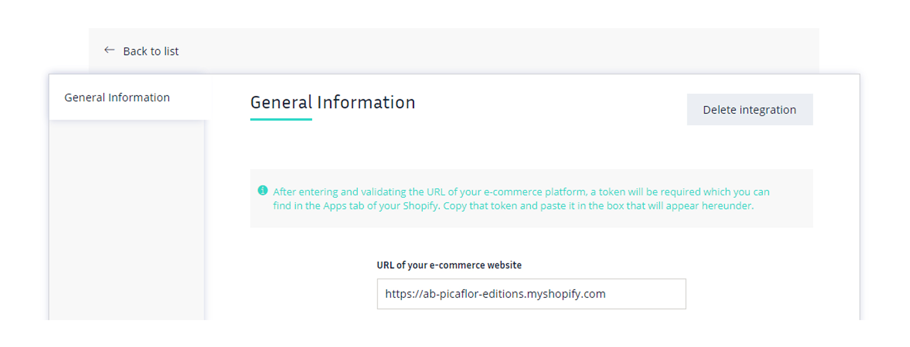

Once the app is installed, Shopify will provide you a token. Please copy this token and paste it in the newly displayed input field in your EventsUnited installation page.

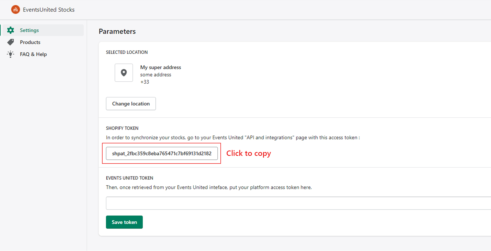

Then click on the "Test connection" button. If an error occured please check rigorously what you did (see [FAQ](#faq)).

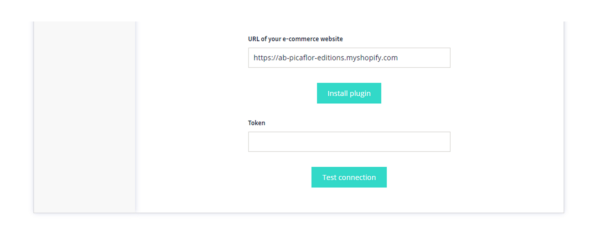

## Platform selection

"Connection OK" ? Great ! Let's keep going.

Now EventsUnited is asking you to select a logistic platform. This step is mandatory. 

Select the platform of your choice. 

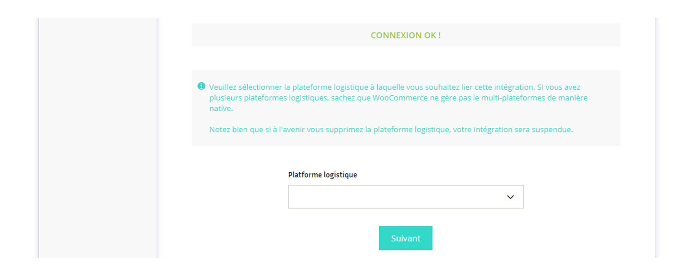

If you need to add multiple paltforms, please see [FAQ](#faq).

## Products options mapping

Now comes the part where EventsUnited ask you to map the "Size", "Print", and "Color" attributes of the platform with the matching ones on Shopify.

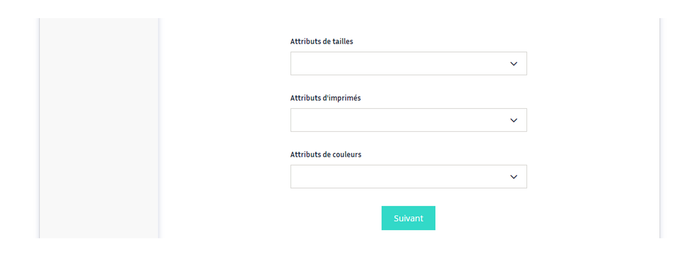

⚠ Here is a very important part. If for whatever reason a brand owns a product which has both a print and a color attribute in EventsUnited (which is definitly possible) you will have to set up the attributes a bit differently. 

Shopify's way of handling products variants is not really compatible with the way EventsUnited handles its attributes.

Hence, if a brand needs to have these two options on one product in Shopify, it is **mandatory** that these attributes are gathered in one and only option (e.g. an option called "Print & Color").

⚠ Another important part, it is not possible to pass the installation process without choosing an option for all select inputs. This means that if a brand owns products which only have print options or only color options, they either need to provide a bogus option in one select, or to select the same option in "Print" and "Color" select.

See [FAQ](#faq) for more detailed informations.

## Enable synchronization

We are almost done setting up the pairing.

Now EventsUnited has generated a token for you. You need to copy this token, and paste it in the empty field in your Shopify app (same process as before but in the opposite direction). 

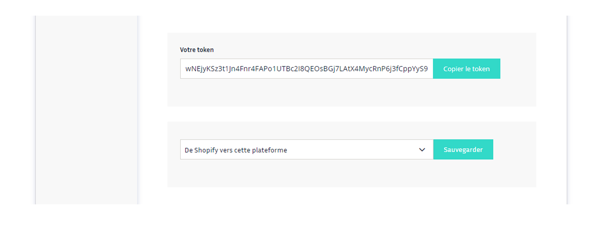

This will allow the Shopify app and the EventsUnited app to communicate together.

Also, EventsUnited is asking you how you would like to initially synchronize your products.

**Option A** : Take stocks from Shopify and put it in EventsUnited **( == Erase EventsUnited's stocks)**

**Option B** : Take stocks from EventsUnited and put it in Shopify **( == Erase Shopify's stocks)**

This is very important, as you will have no solution to restore erased stocks. ⚠ Be extremly careful.

Once you took a decision, click on the "Save" button.

Then head to the "Status" tab.

You can now click on the toggle button to enable synchronization, and start to map your products, and options values.

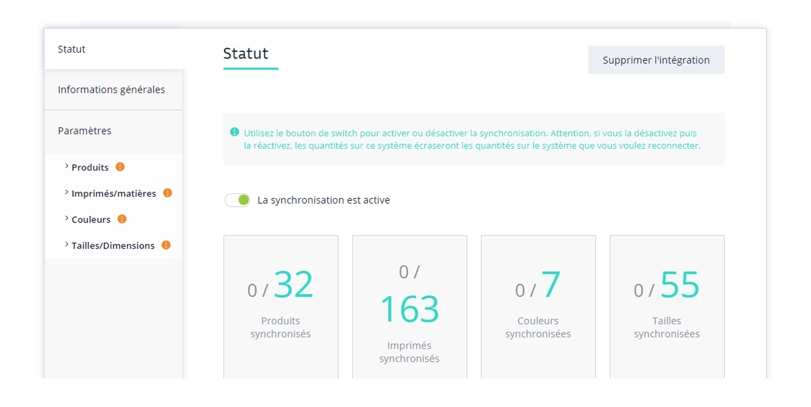

# Usage

## Products and options value mapping

When you access "Products", "Print", "Color", or "Size" tab, you will get a list of values loaded from your EventsUnited account. 

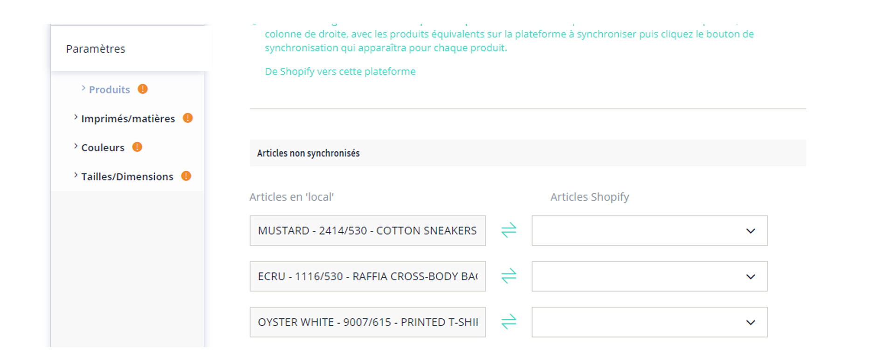

On the right column, you will need to manually choose the associated value from your Shopify store. 

If a value from Shopify 100% matches a value from EventsUnited, it will be automatically pre-selected. 

In any cases, you will need to click on the red sync button on the right side of the input field to initialize synchronization. 

Once clicked, the button becomes orange. It means the the synchronization process has started. It is recommended to wait a bit before closing or refreshing the page.

Once you waited a little bit, you can refresh the page. If everything went well, the sync button should have become green.

> Brand : My product/option disappeared ??

> Support : Say what ?

**No worries !** You may just have an exhaustive list of products, scroll at the bottom. Products in this list are sorted, and the succesfully synchronized products appear right at the bottom of your page !

Once you are all set up, please try to manually change one stock either on Shopify or EventsUnited (according to the option you chose) and see if it impacts the other one. 

And voilà ! It should be all fine. If it is not, I recommend to have a look at the [FAQ](#faq). If the problem persists, contact someone from the support or dev team !

I hope this helped.

# Locations / Warehouses

If you have multiple Shopify locations, it is now possible to choose which one you want to synchronize to EventsUnited marketplace.
By default, your defaultShopify location will be selected, but you can easily change it.
It is recommended to select your desired location before finishing your first integration, however you still be able to change it afterwards.

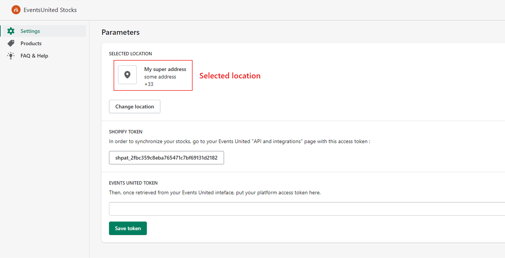

If you decide to change your selected location when your synchronization is already up and running, it is recommended to trigger a manual synchronization on every of your products. You can do so by heading into the "Products" section of your app (see below).

# Test synchronization or re-synchornize

The app now provides you a simple way to test the synchronization of your products (or to re-synchronize them).

The list of products can take a while to load (depending on how many product & variants your store has). Then you can synchronize a single product or choose to do it in bulk.

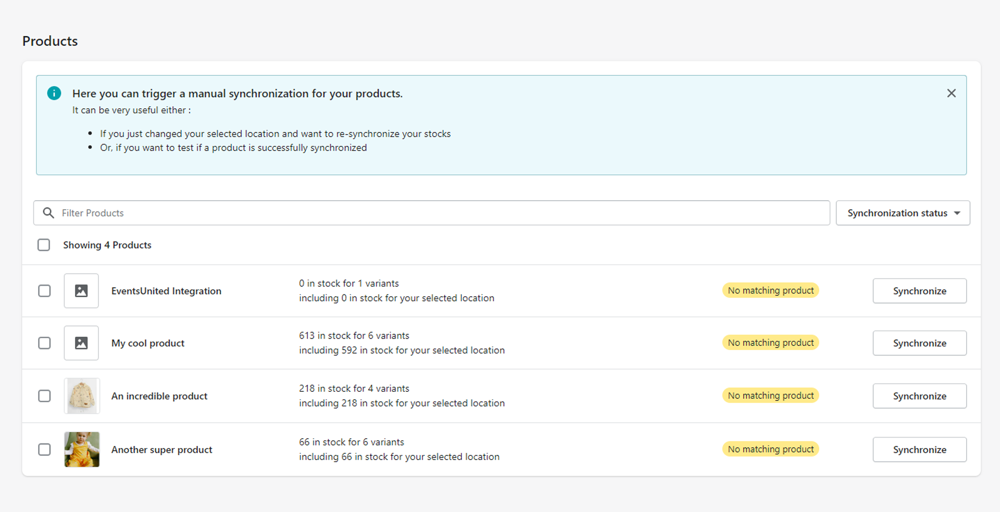

Once synchronization process is done, the app display a status for each product. If the status is not "success" you can click on it to have more informations about which variant caused an issue (and possibly why).

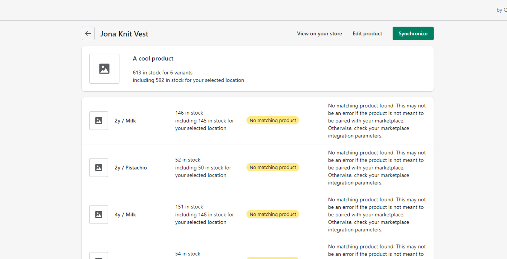

# FAQ

    

        I do not manage to install the Shopify application on my store, why ?
    

    

    

        
<strong>Please make sure that the URL you prompted inside the input field on EventsUnited respects the following syntax : </strong><code>mystore.myshopify.com</code>

        
Without respecting this the app will not be able to recognize your store and install the app properly.

        
❌ <strong>WRONG : </strong><code>https://mystore.com</code>

        
❌ <strong>WRONG : </strong><code>https://mystore.myshopify.com/admin</code>

        
✔️ <strong>RIGHT : </strong><code>mystore.myshopify.com</code>

        
✔️ <strong>RIGHT : </strong><code>www.mystore.myshopify.com</code>

        
✔️ <strong>RIGHT : </strong><code>https://www.mystore.myshopify.com</code>

        
For some reason, if the link generated by picaflor to install the app on your store fails to do it properly (for example if you provided a mistaken shop URL once), you can manually prompt the url to install the app by yourself. This is the current URL to do so : <code>https://ab-picaflor-editions.herokuapp.com/auth/inline?shop=mystore.myshopify.com</code> and of course replace <code>mystore</code> by the respective store url.

    

    

        I need to synchronize more than one EventsUnited platform to my Shopify store, how do I proceed ?
    

    

    

        
Sadly, <strong>this is not yet possible.</strong> If you need to synchronize stocks from your Shopify store to multiple platforms it is required to use several Shopify stores (think about Shopify multisite, as you would regularly do for a multi-languages Shopify store for example).    If you already have different Shopify stores, then you need to set up multiple plugin integrations on your EventsUnited interface, one for each Shopify store. Naturally, you will need to install EventsUnited's Shopify app on each of your Shopify store.

    

    

        I only have colors attributes and no print (or only print and no color), I can't pass the installation process, what am I suppose to do ?
    

    

    

        
 If you get into this issue, you probably already noticed that it is not possible to go any further in the installation process if you are not able to provide both a "Print" and a "Color" attribute (as well as a "Size" one of course) to link between Shopify and Events United.    If you alreayd have a "Print" or "Color" attribute (product option), you will need to take 30 seconds to think about your store.   If you think you will not ever need to have both attributes, then just create an option with a bogus (yet recognizable) name as it is definitly non important.   However, we always recommend on creating an option allowing you to use both "Print" and "Color" attributes. In order to properly set your Shopify store up, see the question below. 

    

    

        I have a product on EventsUnited which have a print variation as well as a color one, how am I supposed to set up my product in Shopify appropriately ?
    

    

    

        
 Shopify and EventsUnited differ in the way they handle product variations.   As of today if a product on your EventsUnited interface has both a "Print" and a "Color" attribute, the only available solution yet is to create on your Shopify's products an option managing both.    In other words, instead of having an option, let's say, called "Print", and another one called "Color" for example, you would need to have an option called "Print & Color" in which you would handle every cases.    Once this option would be set up in your Shopify store, when linking and setting up the app in Events United, you would need to map both Events United's "Print" and "Size" attribute to this one and only "Print & Color" Shopify option. Then you would map each option value to their appropriate Events United value as you would normally do.
        
 
        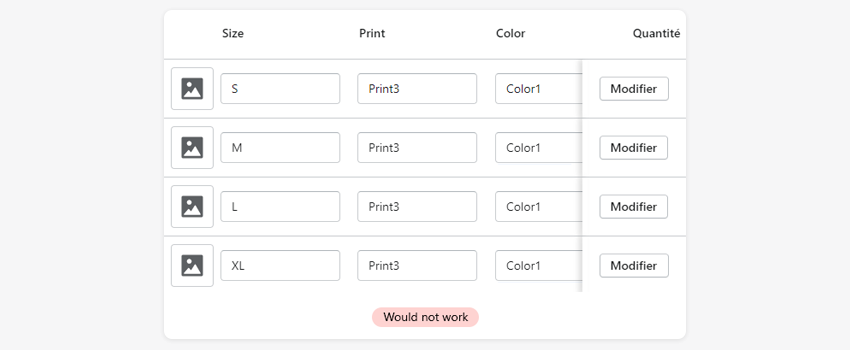
        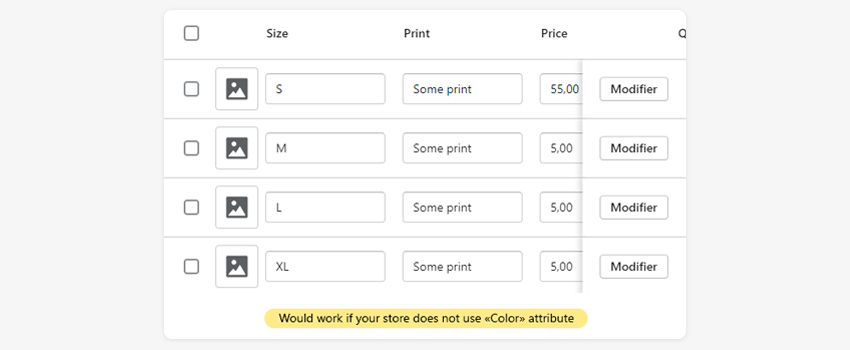
        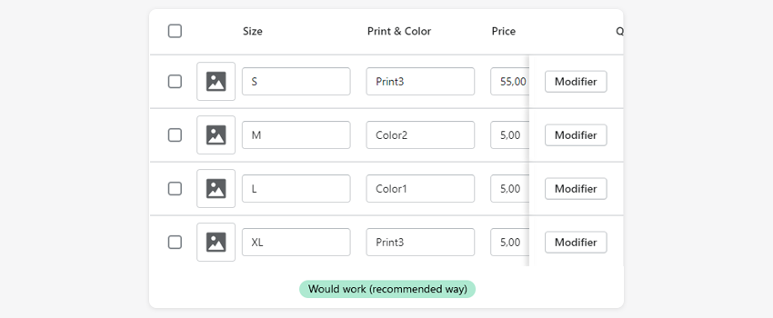
    

    

        I have a product succesfully linked with EventsUnited, yet my stock does not seem to update, why ?
    

    

    

        
 If your product is displayed as synchronizeed in EventsUnited, it may not necessarily means that the stocks synchronization is working.     Please double check that : <ul> <li> Your product is matched with the respective product on both sides </li> <li> Your Shopify product options values are properly mapped with the EventsUnited ones </li> <li> <strong>Your Shopify product handles print and/or color with one and only option</strong> </li> </ul> If you think you are doing everything right and still not manage to make things work as expected, please feel free to get in touch with the support or developper team. 

    

 

You can also find the FAQ section right in your Shopify app admin :

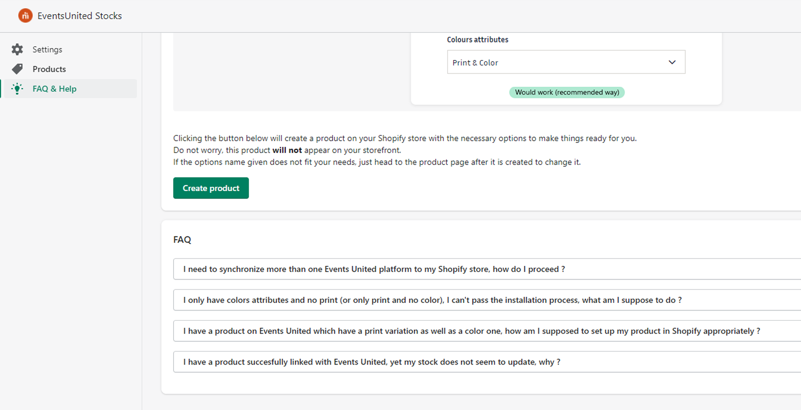
